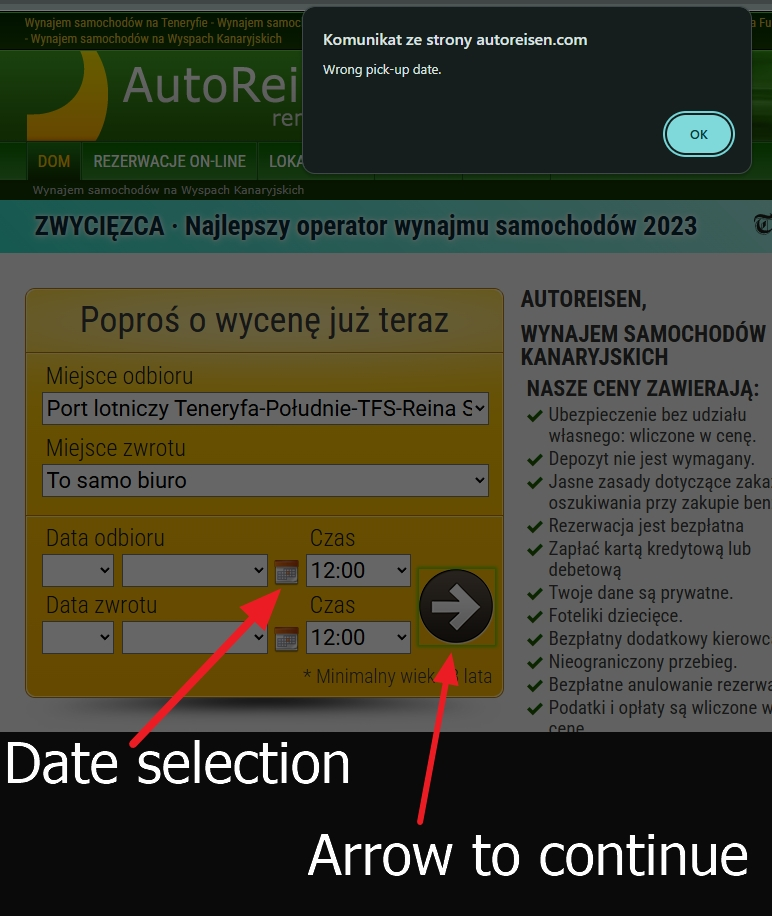

# BUG-002: Datapicker failure during Chrine Auto-Translate

**Priority:** High
**Environment:** Windows 11 / CHrome 143.0.7499.193

### Summary
In the date picker, after selecting a specific date, the fields become empty. The system does not allow the user to proceed and shows an alert indicating that an invalid date was selected.

### Steps to Reproduce
1. Open page https://autoreisen.com
2. Right-click anywhere on the page and select "Translate to Polish".
3. Open the pickup/return date calendar.
4. Select any avaible dates.

### Expected Result
Select the pickup and return date, then go to the car selection page.

### Actual Result
After selecting the dates, the sields become empty. When clicking the arrow to continue, an akert appears saying the wrong date was selected. 

### Workaround
Disable Chrome Auto-Translate or revert to the "Original Language" to restore functionality.

### Attachments
